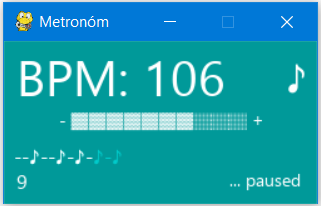

# Metronóm / Metronome

## Jednoduchý metronóm

Win:   
Nakopírujte VŠETKY súbory - exe, wav, ttf - niekam do počítača (do toho istého priečinka).   
Spustite metron.exe   

Linux:   
Je potrebné mať nainštalovaný Python3 a modul pygame.   
Spustite python3 metron.pyw

Ovládanie:
 - Klávesnica
   - plus, mínus               : hlasitosť
   - šípka vpravo, šípka vľavo : zvýšenie/zníženie BPM o 10
   - šípka hore, šípka dole    : zvýšenie/zníženie BPM o 1
   - medzera                   : pozastavenie programu
   - q                         : koniec programu
  - Myš
    - kliknutím na BPM zvyšujete/znžujete BPM o 10 (ľavé alebo pravé tlačidlo myšky)
    - kliknutím na + a - upravujete hlasitosť

Rytmus:   
Program môže zobrazovať rytmus a zmeniť zvuk pri dobe/takte v rytme, na ktorej je dôraz. Spustite metronóm s parametrom nazovSuboruSRytmom, alebo potiahnite súbor s rytmom cez exe súbor (pre  Win).

Súbor s rytmom:   
Súbor môže mať jeden alebo dva riadky. Na prvom riadku musí byť rytmus, na druhom môže byť číslo s požadovaným BPM pre uvedený rytmus.      
Všetky znaky x v prvom riadku sú považované za dobu s dôrazom. Ostatné znaky môžu byť ľubovoľné (pre dobu bez dôrazu), viď. tiež solea.txt alebo valz.txt.   
Príklad súboru pre Soleá (hrá sa na 12 dôb, s prízvkom na 3, 6, 8, 10 a 12 dobe, s rytmom 115 BPM):      
nnxnnxnxnxnx   
115   

Zmena zvukov:   
Program prehráva súbory so zvukmi, ktoré majú názov metr.wav a metr_h.wav. Pre dobu s dôrazom prehrá metr.wav. Ak chcete iný zvuk, premenujte súbor/súbory s Vaším zvukom na uvedené názvy (metr.wav a metr_h.wav). Napr. premenujte súbor clap_h.wav na metr_h.wav. Zmeniť prehrávané zvuky je možné aj zmenou v konfiguračnom súbore metronom.json.   

Konfiguračný súbor:       
Ak existuje súbor s názvom metronom.json, spúšťa sa metronóm podľa nastavení, ktoré sú uvedené v tomto súbore. Je možné zmeniť:   
 - zvuky   
 - počiatočnú BMP   
 - maximálnu a minimálnu BMP   
 - farbu pozadia programu (ako hexadecimálnu hodnotu)   
 - maximálnu dĺžku rytmu   
 - súbor s rytmom (súbor sa sutomaticky načíta po spustení programu)

## Simple metronome

Win:   
Copy all files - exe, wav, ttf- to your computer (to the same directory).   
Run metron.exe    

Linux:    
Required python3 and module pygame.   
Run python3 metron.pyw

Controls:
 - Keyboard
   - plus, minus              : volume
   - arrow left, arrow right  : increase/decrease BPM by 10
   - arrow up, arrow down     : increase/decrease BPM by 1
   - space                    : pause
   - q                        : quit 
  - Mouse
    - click on BPM to increase/decrease BPM by 10 (left or right mouse button)
    - click on + or - to increase/decrease volume

Rhythm:   
The program can display the rhythm and change the sound at the time/beat in the rhythm that is emphasized. Run the metronome with the parameter FilenameWithRhythm, or drag the rhythm file via the exe file (for Win).

Rhythm file:   
The file can have one or two lines. The first line must contain a rhythm, the 2nd may contain a number with the required BPM for the specified rhythm.   
All x characters in the first line are considered accented. Other characters can be arbitrary (for beats without emphasis), see examples solea.txt, valz.txt.   
Example file for Soleá (accent/emphasis on 3rd, 6th, 8th, 10th and 12., with rhythm 115 BPM):   
nnxnnxnxnxnx   
115    

Sound files:   
Program plays sound from files metr.wav and metr_h.wav. Rename your own sound files to metr.wav and/or metr_h.wav, for example rename lap_h.wav to metr_h.wav.

Configuration file:       
If exists file metronom.json, program runs with settings from configuration file. Settings:   
 - sound files   
 - starting BMP   
 - maximal a minimal BMP   
 - background coloe (hexadecimal value)   
 - maximal rhytm length   
 - rhytm file (file is loaded automatically at stort of the program)

Poznámky/Notes:   
ttf downloaded from http://www.freefontsdownload.net   
exe created by: pyinstaller --onefile metron.pyw (on W10)

Credits to: vladonix@gmail.com  :)
